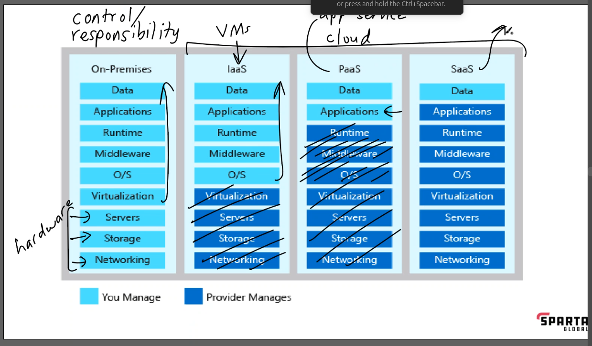

# Cloud notes 

## cloud services: 

* AWS 
* Azure 
* GCP 

## what is the cloud? 

* computing power, network, databases and storage 
* service avalable to you over the internet 
* centrally managed 

## How do we know if something is in the cloud? 

something stored on the cloud can be accessed via the internet from multiple devices 

## Differences between on-prem and the cloud? 

**On-prem**: Users have full control over their infrastructure and data.  
**Cloud**: Users have less control over their data and environment, and rely on a third-party provider. 

## The 4 deployment models of cloud: private vs public vs hybrid vs multi-cloud - Differences? How do they work? 

### Private cloud

**How it works**: A company hosts its own cloud computing services and infrastructure within its data center or intranet.  
**Benefits**: Provides control and security, making it ideal for sensitive data and applications.  
**Who uses it**: Businesses use private clouds for their most critical applications.  

### Public cloud

**How it works**: A cloud service provider owns and operates the physical servers and makes them available to users over the internet.  

**Benefits**: Provides scalability and cost efficiency, making it ideal for dynamic workloads.  

### Hybrid cloud

**How it works**: Combines private and public clouds, allowing data, applications, and functions to move between the two environments.  

**Benefits**: Provides flexibility and compliance, and is often used for latency-sensitive applications.  

### Multi-cloud 

**How it works**: Uses multiple public cloud providers from different vendors.  
**Benefits**: Provides resilience and avoids vendor lock-in.  

## Types of cloud services: IaaS, PaaS, SaaS - What are differences? 

## What are the advantages/disadvantages of the cloud? (Particularly for a business) 

* advantages: 
  * cost saving 
  * scalability 
  * accesibility 
  * collaboration 
  * reliability
* disadvantages: 
  * security concerns 
  * lack of control 
  * locked in to one system 
  * reliant on the internet 
  
## Difference between OpEx vs CapEx and how it relates the cloud 

* Capital expenditures (CapEx) are one-time investments in assets
* operational expenditures (OpEx) are ongoing costs.
 
In cloud computing, CapEx is often associated with purchasing hardware, while OpEx is associated with buying capacity. 

## Is migrating to the cloud always cheaper? 
NO!  
Depends on various factors, including the specific use case, workload characteristics, and organisational goals. 

## Marketshare - What is the breakdown? Add a diagram to help understand marketshare trends 

## What are the 3 largest Cloud providers known for (What makes them popular?) 
The three largest cloud providers are Amazon Web Services (AWS), Microsoft Azure, and Google Cloud Platform (GCP). They are known for their wide range of cloud-based products and services, which offer flexibility, scalability, and cost-savings. 

## Which cloud provider do you think might be the best? Why? 
personaly, I think this would be very dependent on where you are working and the needs of your project / busness, as each service has its own pros and cons. 

## What sorts of things do you usually need to pay for when using the cloud? 
What are the 4 pillars of DevOps? How do they link into the Cloud? 